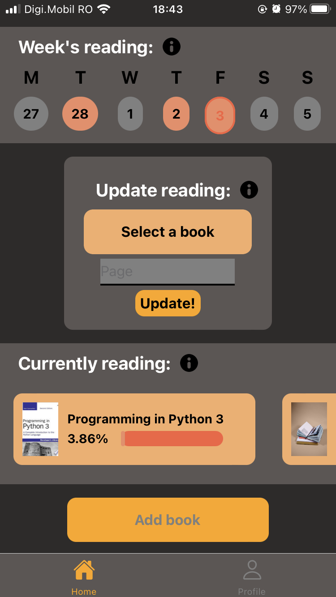
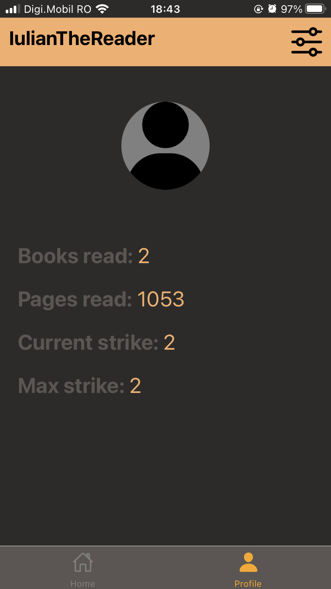
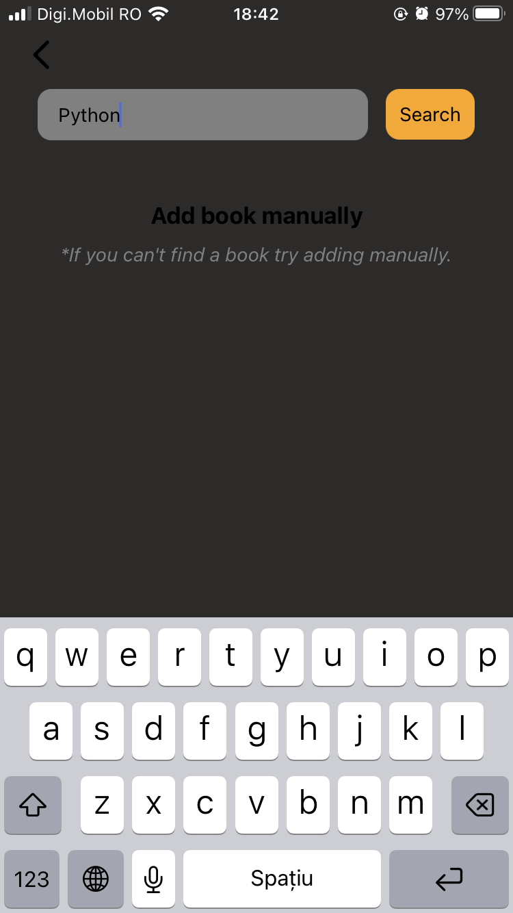
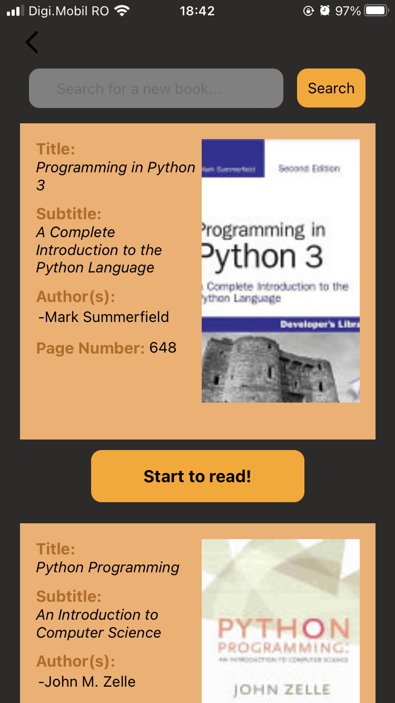
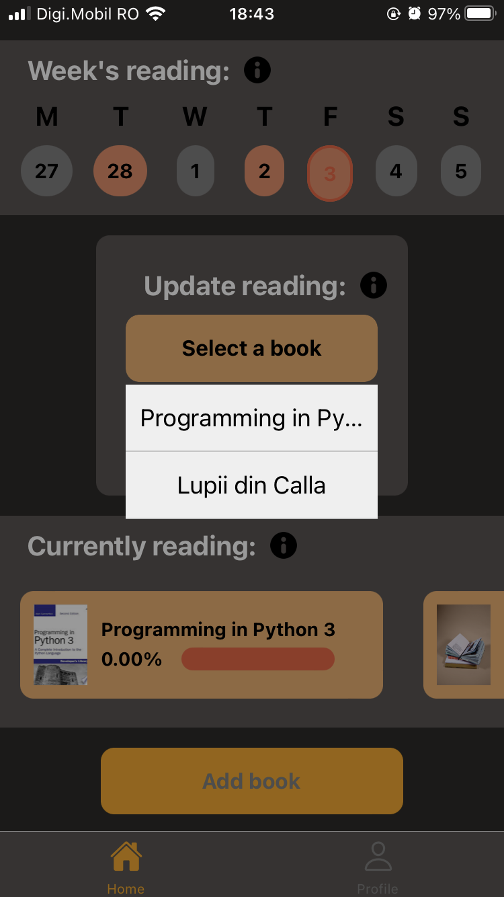
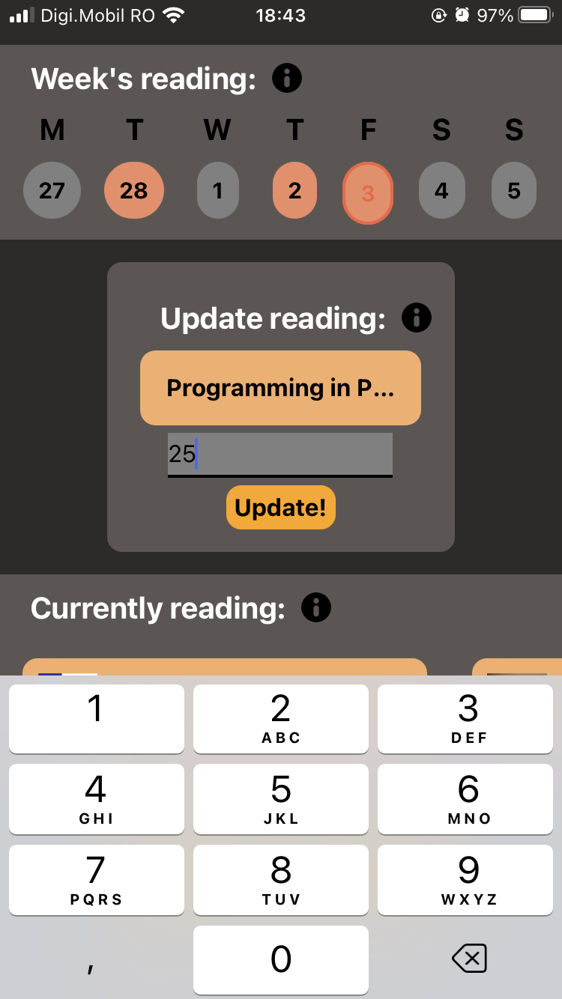
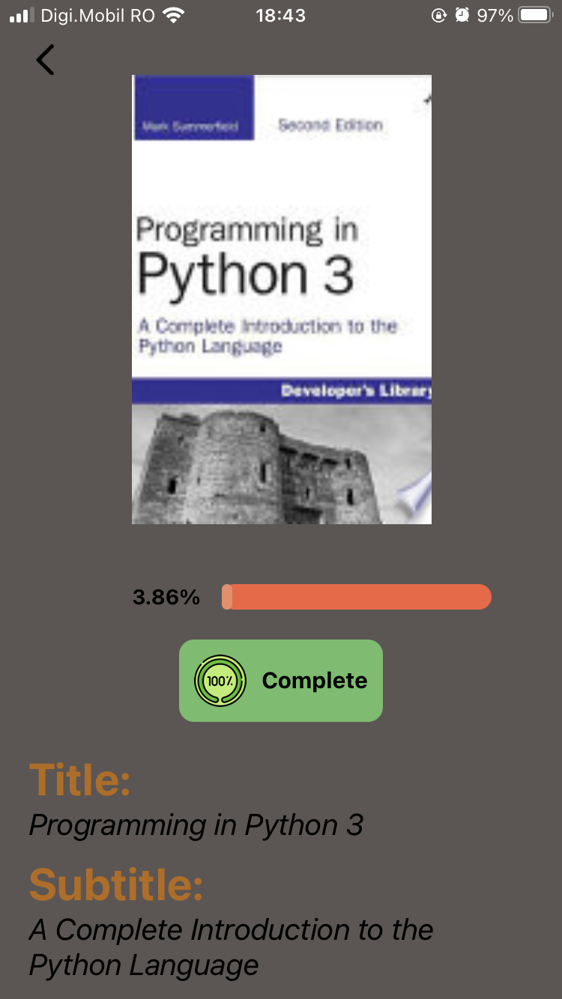
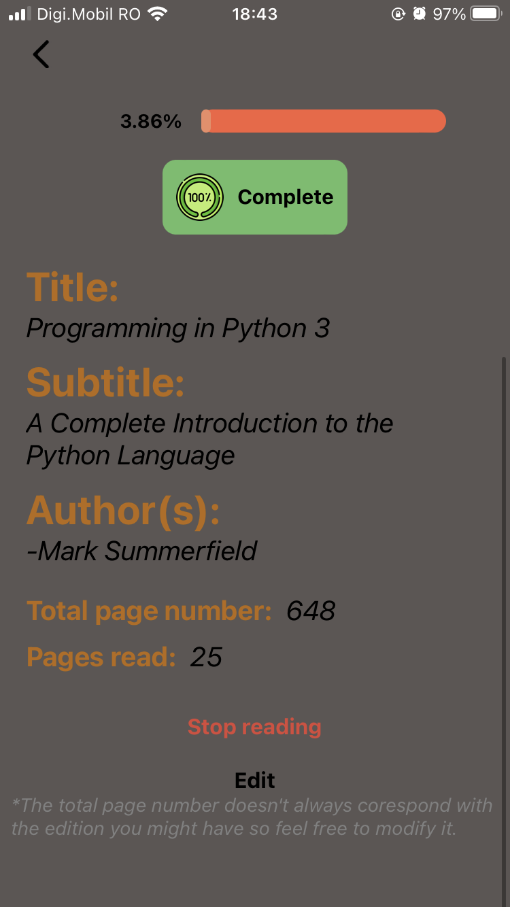

# YouRead - read by creating a habit

If you ever felt that you want to read more but don't know how to get motivate to pick up the book this app is coming to help you.    

  
  

    

---

You can add books by pressing the *Add book*. There you can search for your book or add the book manually. The books displayed are provided by the Google Books API, so if you can't find a book is because they don't have it.    

  
  

    

---

After you added your book you can start reading it. To count your readings you need to select de book you want to read and the page you reached.    

  
  

    

Also, you can see books details by checking the library below Update Reading. Every book has a *Complete* button to finish the book, an *Edit* button to edit the total number of pages it has and last, but not least a *Stop reading* button.

  
  

    

---

This project had the purpose to help me learn how to use Firebase and also it was meant to have a bit more features like:
 
- [ ] *Friends* - the user would be able to follow other users and see their progress
- [ ] *Achivments* - an award system so the user feel more motivated to read
 
